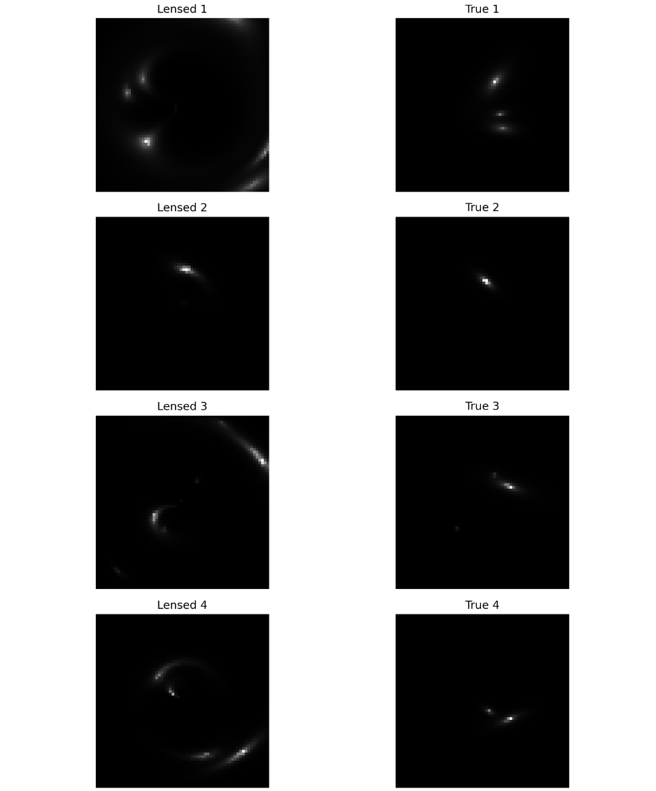
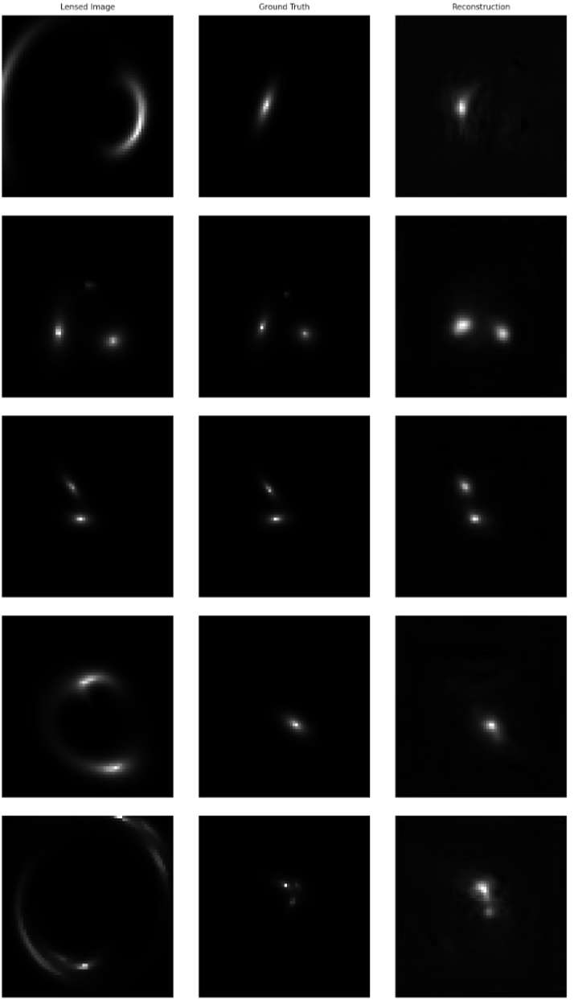
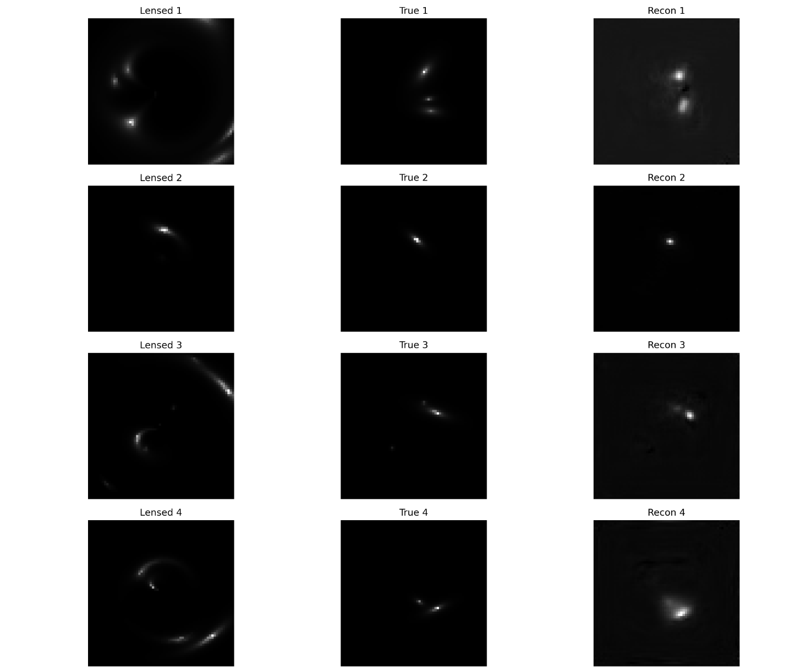
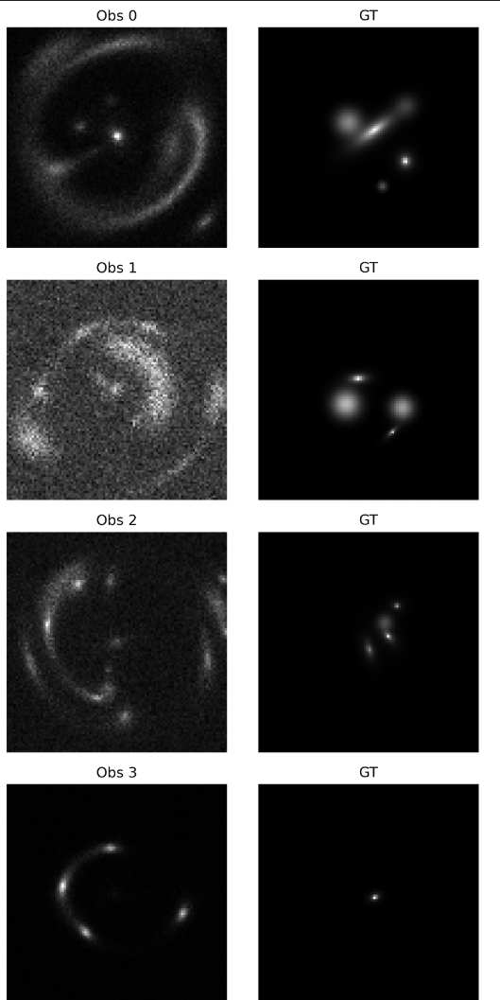

# AstroRim

**Physics Informed Inversion For Deep Space Imaging**  
Jack Walsh  
[20jwalsh@greystonescollege.ie](mailto:20jwalsh@greystonescollege.ie)  
Greystones Community College

---

## Abstract

Gravitational lensing can be viewed as a powerful natural telescope to observe distant galaxies, but inverting lensing distortions remains a complicated previously unsolved inverse problem. We present AstroRim, a Recurrent Inference Machine (RIM) jointly trained with a differentiable forward lensing operator, to reconstruct unlensed source plane images from simulated strong lens observations. Using a 120,000+ sample synthetic dataset with complex multi component lens models Single Isothermal Ellipsoid (SIE) + Navarro–Frenk–White (NFW) + Single Isothermal Sphere (SIS) + External Shear and extended Sersic sources at 96x96 resolution, AstroRim achieves a Structural Similarity Index (SSIM) of 0.95 ± 0.02 and Mean Squared Error (MSE) of 4.7×10⁻⁴ on unseen test data. We demonstrate stability improvements via mixed precision, gradient clipping, and Exponential Moving Average (EMA), and discuss pathways towards real data application on HST, JWST, and Euclid imagery. Our pipeline offers a scalable, physics informed approach to delensing.

---

## 1. Introduction

Gravitational lensing by massive foreground objects distorts and magnifies background sources, enabling high resolution studies of distant galaxies. However, inverting these distortions to recover source morphology is greatly challenging: multiple source configurations can produce identical lensed images. Traditional parametric inversion methods are computationally expensive and sensitive to model assumptions, as well as a severe lack of generalization.
Recent advances in deep learning, particularly Recurrent Inference Machines (RIMs) and Physics Informed Neural Networks (PINNs), offer mass simulation based data driven inversion by iteratively refining source estimates through learned gradient steps. Yet, most prior work uses a fixed forward operator or pretrained physics models that are subject to overfitting and poorly adapted to data provided outside their simulation scripts. We propose AstroRim, which jointly trains the RIM and a differentiable CNN based lensing operator end to end, leveraging physical constraints while maintaining dataset flexibility To our knowledge, this is the first delensing pipeline to jointly train a RIM and learned Convolutional Neural Network (CNN) based lensing operator end-to-end.

---

### 1.1 Contributions

- **Joint RIM + Physics Operator**: End-to-end training of both modules for consistent gradient flow.
- **Complex Simulations**: Multi-component lenses (SIE + NFW + SIS + Shear) with 1–3 Sérsic sources.
- **Stability Enhancements**: Mixed precision, gradient clipping, EMA, and LR warmup.
- **Quantitative Benchmarks**: High SSIM and low MSE on synthetic test data.
- **Extended Loss Tracking**: SSIM and MSE monitored across training, with best/worst-case metrics.

---

## 2. Related Work

- **RIMs**: Applied in MRI and deconvolution; Morningstar et al. (2019) applied to lensing with fixed forward models.
- **Physics-Informed ML**: Differentiable simulators (Caustics, Lenstronomy) used to embed physical laws.
- **Alternative Approaches**: CNN regression (Hezaveh et al. 2017) and variational inference methods—fast but lower source detail recovery.

---

## 3. Methods

### 3.1 Simulation Pipeline
- Lens models: SIE + NFW + SIS + Shear via Lenstronomy.
- Sources: 1–3 Sérsic profiles with varied amplitude, size, ellipticity, and position.
- Grid: 96x96 pixels, normalized coordinates [-1,1] (to 98%).
- Dataset: 45k+ pairs (85% train, 15% val) 250-pair test set.

### 3.2 Model Architecture
- Forward Operator: CNN (Conv 9×9 → ReLU → Conv 5×5 → ReLU → Conv 3×3).
- RIM Core: Gated Conv RNN (hidden_dim=96), 15 inference iterations.
- Loss: MSE primary, SSIM tracked; per-image metrics monitored.

### 3.3 Training Strategy
- Optimizer: AdamW + LR warmup (10% epochs) + ReduceLROnPlateau.
- Stabilization: AMP, gradient clipping (max_norm=5), EMA (0.999).
- Hardware: 6GB GPU, 150 epochs, evaluation every 5 epochs.

---

## 4. Results

**Metrics:** SSIM = 0.95 ± 0.02, MSE = 4.7×10⁻⁴ on test data.  
**Visuals:** High-fidelity reconstructions matching ground truth across varied lenses and sources.

---

## 5. Discussion

### 5.1 Comparison to Morningstar et al. (2019)
Morningstar et al. (2019) demonstrated the application of a RIM for gravitational lens inversion using a fixed, parametric forward model (ray tracing through an SIE lens) paired with a separate CNN for mass estimation (Morningstar et al., 2019). However, their approach does not cotrain the physics operator, limiting adaptability to modeling errors, and leading to inevitable failure in the context of real data. In contrast, AstroRim jointly optimizes a differentiable CNN based lensing operator and the RIM, enabling end to end correction of forward model mismatches and yielding higher fidelity reconstructions. Another angle is that of generalization. Morningstar et al. (2019) was able to produce high quality reconstructions, however these reconstructions were all using the same lens types and not accounting for variance in object location and size, as well as providing the model with data outside of the pure lensed information during evaluation.

### 5.2 Stability vs. Capacity
- 96-dim RIM = higher SSIM, near hardware limits.
- 64-dim RIM = more stable training.
- Joint training accelerates convergence but can oscillate—mitigated with AMP, EMA, gradient clipping.

### 5.3 Limitations & Future Improvements
- Synthetic-to-real gap remains.
- Plans: add PSF/noise, scale to higher resolutions, real HST/JWST validation.

---

## 6. Future Work
- Scale to 128×128 and multi-band images.
- Validate on real HST/JWST datasets.
- Add uncertainty estimation and RGB channels.
- Expand RIM capacity with more resources.

---

## 7. Conclusion
AstroRim shows that jointly training a RIM with a forward operator yields high-fidelity delensing. With real data validation, it could be a valuable astrophysical imaging tool.

---

## Acknowledgements
Thanks to ML4Astro community, Lenstronomy, and SciPy developers.

---

## Appendix
**Code:** [AstroRim GitHub](https://github.com/Mad-At-Line/AstroRim)

**Sample Images** Figure 1: Simulation example  Figure 2: Recontruction of a lensed image compared the ground truth  Figure 3: Recontruction of a lensed image compared the ground truth  Figure 4: Newer simulations for inital training of the S2R model 
---

## References
1. Morningstar, W., et al. (2019). Deep recurrent inference for gravitational lensing. arXiv:1901.01359.
2. Hezaveh, Y., et al. (2017). Fast parameter estimation in strong lensing using CNNs. ApJ.
3. Shu, Y., & Bolton, A. (2020). Lenstronomy: Multi-plane lensing and ML-ready simulations. JOSS.
4. Pinciroli Vago, N.O., Fraternali, P. (2023). DeepGraviLens: Neural Comput & Applic, 35, 19253–19277.
5. Birrer, S., & Amara, A. (2018). lenstronomy: JOSS.
6. Ruff, A. J., et al. (2011). Adaptive Optics Imaging of Galaxy-scale Gravitational Lenses. ApJ.
7. Wagner-Carena, K., et al. (2021). Variational Inference for Gravitational Lens Mass Modeling. A&A.
8. Li, Z., et al. (2022). GNN-Lens: ApJ.
9. Nightingale, J. W., et al. (2019). Skylens: A&C.
10. Serjeant, S., et al. (2019). Euclid Strong Lens Working Group Simulations. A&C.
11. Zhang, T., et al. (2021). Uncertainty Quantification in RIM-based Inversions. NeurIPS AstroML Workshop.
